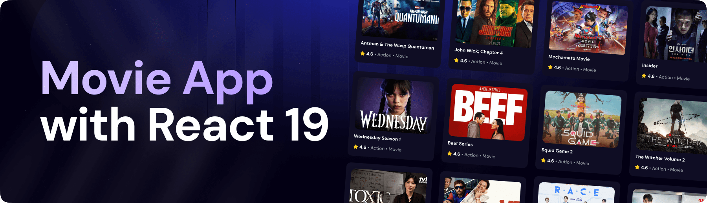

<div align="center">
  <br />
    <a href="" target="_blank">
      
    </a>
  <br />
  
  <div>
    
    
    
  </div>

  <h3 align="center">A Movie Application</h3>

</div>

## <a name="introduction">🤖 Introduction</a>

Built with React.js for the user interface, Appwrite for backend services, and styled with TailwindCSS, this Movie App lets users browse trending movies, search titles, and explore content using the TMDB API. It features a responsive layout and a sleek, modern design.

## <a name="tech-stack">⚙️ Tech Stack</a>

- **[Appwrite](https://appwrite.io/)** is an open-source Backend-as-a-Service (BaaS) platform that provides developers with a set of APIs to manage authentication, databases, storage, and more, enabling rapid development of secure and scalable applications.

- **[React.js](https://react.dev/reference/react)** is a JavaScript library developed by Meta for building user interfaces. It allows developers to create reusable UI components that manage their own state, leading to more efficient and predictable code. React is widely used for developing single-page applications (SPAs) due to its virtual DOM that improves performance and ease of maintenance.

- **[React-use](https://github.com/streamich/react-use)** is a collection of essential React hooks that simplify common tasks like managing state, side effects, and lifecycle events, promoting cleaner and more maintainable code in React applications.

- **[Tailwind CSS](https://tailwindcss.com/)** is a utility-first CSS framework that provides low-level utility classes to build custom designs without writing custom CSS, enabling rapid and responsive UI development.

- **[Vite](https://vite.dev/)** is a modern build tool that provides a fast development environment for frontend projects. It offers features like hot module replacement (HMR) and optimized builds, enhancing the development experience and performance.

## <a name="features">🔋 Features</a>

👉 **Browse All Movies**: Explore a wide range of movies available on the platform.

👉 **Search Movies**: Easily search for specific movies using a search function.

👉 **Trending Movies Algorithm**: Displays trending movies based on a dynamic algorithm.

👉 **Modern UI/UX**: A sleek and user-friendly interface designed for a great experience.

👉 **Responsiveness**: Fully responsive design that works seamlessly across devices.

and many more, including code architecture and reusability

## <a name="quick-start">🤸 Quick Start</a>

Follow these steps to set up the project locally on your machine.

**Prerequisites**

Make sure you have the following installed on your machine:

- [Git](https://git-scm.com/)
- [Node.js](https://nodejs.org/en)
- [npm](https://www.npmjs.com/) (Node Package Manager)

**Cloning the Repository**

```bash
git clone https://github.com/magda5281/react-movies-app.git
cd react-movies

```

**Installation**

Install the project dependencies using npm:

```bash
npm install
```

**Set Up Environment Variables**

Create a new file named `.env.local` in the root of your project and add the following content:

```env
VITE_TMDB_API_KEY=

VITE_APPWRITE_PROJECT_ID=
VITE_APPWRITE_DATABASE_ID=
VITE_APPWRITE_COLLECTION_ID=
VITE_APPWRITE_ENDPOINT=
```

Replace the placeholder values with your actual **[TheMovieDatabase API](https://developer.themoviedb.org/reference/intro/getting-started)** and **[Appwrite](https://apwr.dev/JSM050)** credentials.

**Running the Project**

```bash
npm run dev
```

Open [http://localhost:5173](http://localhost:5173) in your browser to view the project.
